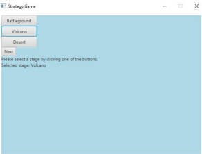

For full documentation, see project_document.pdf

# Strategy Game

**Author:** Ilmari Oivanen  
**Date:** April 25, 2023  

## General Description

This project is a fantasy-themed turn-based strategy game with an AI opponent. The player commands a group of different characters, each with unique skills. Some characters provide support with healing and buffs, while others focus on dealing damage. The player can assemble their team in multiple ways, selecting from a roster larger than the maximum party size of three.

Features:
- Multiple playable stages with different backgrounds and effects.
- Player vs. AI combat in 1v1, 2v2, or 3v3 battles.
- Save and load game progress via XML files.
- AI opponent selects characters randomly to match the player's party size.

## User Interface

To run the game, execute the `GameApp` object in `src/main/scala/GameApp.scala`. This will launch the main menu. 

### Menu Options
- **Continue Game** – Resumes a saved game (if available).
- **New Game** – Starts a new match (deleting old save data).
- **Save Game** – Saves current progress.
- **Load Game** – Loads previously saved data.
- **Exit Game** – Press `Esc` anytime to return to the menu.

### Screenshots
_Example UI Screenshots (Upload separately and link below):_

  
  
  
  

### Gameplay
- Select a stage and characters to start a match.
- Use skill buttons to attack or apply effects.
- Turn order is determined by hidden speed stats.
- AI automatically selects its moves based on game state.
- Game over screen displays the result (win/loss) before returning to the main menu.

## Program Structure

The game follows an object-oriented structure with an emphasis on extendability. Character, skill, and stage implementations allow for easy expansion.

## AI Algorithm

The AI opponent prioritizes its actions based on the following logic:
1. **Identify available skills** – Sorts them into attacks, buffs, heals, and debuffs.
2. **Choose a move** – Prioritizes finishing low-HP enemies, healing allies, and buffing strong characters.
3. **Target selection** – Based on HP and game state.
4. **Execute action** – AI automatically takes its turn.

## Data Structures

- **Mutable Buffers & Arrays** – Used for game state tracking.
- **XML File Management** – Saves game progress in `save1.xml`.

## Testing

- The game was tested via GUI interactions and command line but lacks dedicated unit tests.
- AI behavior was manually tested for logical decision-making.
- No known critical bugs, though some turn system issues may exist.

## Known Issues & Missing Features

- Lack of animations and polished character sprites.
- More skill variety could improve gameplay.
- Multi-target skills not implemented.
- Testing and debugging could be improved.

## Strengths & Weaknesses

### Best Aspects
1. **Save File Management** – Reliable XML-based saving/loading.
2. **Extensible Character System** – Easy to add new characters.
3. **Targeting System** – Intuitive and flexible for players.

### Weaknesses
1. **Game Loop Structure** – Overly dependent on user input.
2. **Crowded `GameGui` Class** – Could be better organized.
3. **Lack of Visual Polish** – No animations or detailed sprites.

## Future Improvements

- Implement unit tests for AI and core mechanics.
- Refactor `GameGui` for better readability.
- Improve animations and graphical effects.
- Enhance AI decision-making with deeper strategy.

## References

- [Scala Standard Library](https://www.scala-lang.org/api/3.2.1/)
- [Stack Overflow](https://stackoverflow.com/)
- [Turn-Based Game Loop Guide](https://journal.stuffwithstuff.com/2014/07/15/a-turn-based-game-loop/)
- [ScalaFX Documentation](https://www.scalafx.org/)
